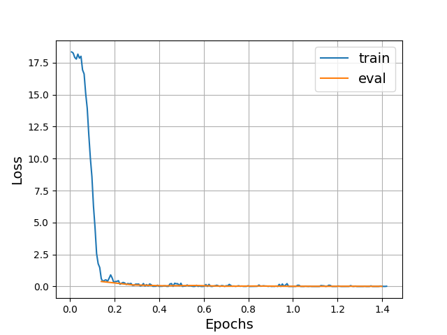
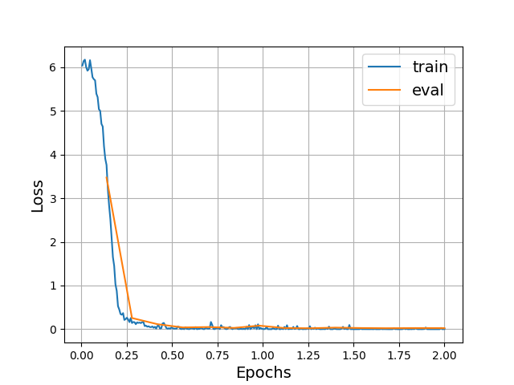

# Ad-Detect-LLM
Using Qwen3-0.6B to detect advertisements in video ASR texts

Created in 2025/09/04 by Haoyu Huang

使用小模型(Qwen3-0.6B、Qwen3-4B-Instruct-2507)识别视频ASR文本中的广告语


## 环境准备
```bash
conda create -n ad-detect python=3.10
conda activate ad-detect
pip install -r requirements.txt
``` 

使用[ms-swift微调框架](https://github.com/modelscope/ms-swift/)。
```bash
pip install ms-swift -U

# please use python=3.10, cuda12.*
# sh requirements/install_all.sh
pip install "sglang[all]<0.5" -U
pip install "vllm>=0.5.1" "transformers<4.56" "trl<0.21" -U
pip install "lmdeploy>=0.5" -U
pip install autoawq -U --no-deps
pip install auto_gptq optimum bitsandbytes "gradio<5.33" -U
pip install git+https://github.com/modelscope/ms-swift.git
pip install timm -U
pip install "deepspeed" -U
pip install qwen_vl_utils qwen_omni_utils decord librosa icecream soundfile -U
pip install liger_kernel nvitop pre-commit math_verify py-spy -U
# flash-attn: https://github.com/Dao-AILab/flash-attention/releases
```

## 运行程序

ms-swift命令行参数解释：
https://github.com/modelscope/ms-swift/blob/main/docs/source/Instruction/%E5%91%BD%E4%BB%A4%E8%A1%8C%E5%8F%82%E6%95%B0.md

### 训练模型
```bash
bash train_sft.sh
```

### 导出LoRA模型
```bash
swift export \
    --model /mnt/e/LLM/Qwen3-0.6B \
    --adapters output/v1-20250915-102750/checkpoint-200 \
    --output_dir output_models/Qwen3-0.6B/ckpt-200 \
    --merge_lora true
```

## 推理测试
```python
python ./src/inference.py
```
### Qwen3-0.6B 训练结果
| Train Epoch   | Acc on testset |
|---------------|----------|
| 0             | 0.4479   |
| 0.84          | 0.8376   |
| 0.98          | 0.8366   |
| 1.40          | 0.8608   |

| Infer time | time |
|----|----|
| **after SFT**| 0.080s/query   |




### MiniCPM4-0.5B 训练结果
|  Train Epoch  | Acc on testset |
|---------------|----------------|
| 0             | 0.3477         |
| 1.54          | 0.9686         |

| Infer time | time |
|----|----|
| **before SFT**| 0.717s/query   |
| **after SFT** | 0.062s/query  |


未训练的`MiniCPM4-0.5B`模型的指令遵循能力较差，如下：

> 否。这段文本不符合广告内容的标准，因为它包含了一些带有侮辱性质的言论，如“大汉赢学”，并且与视频标题“让台湾复刻“西安事变2.0”？新时代网民，正在呼唤大汉赢学”关联较弱。 否

经过训练之后，可以稳定地只输出"是/否"。

